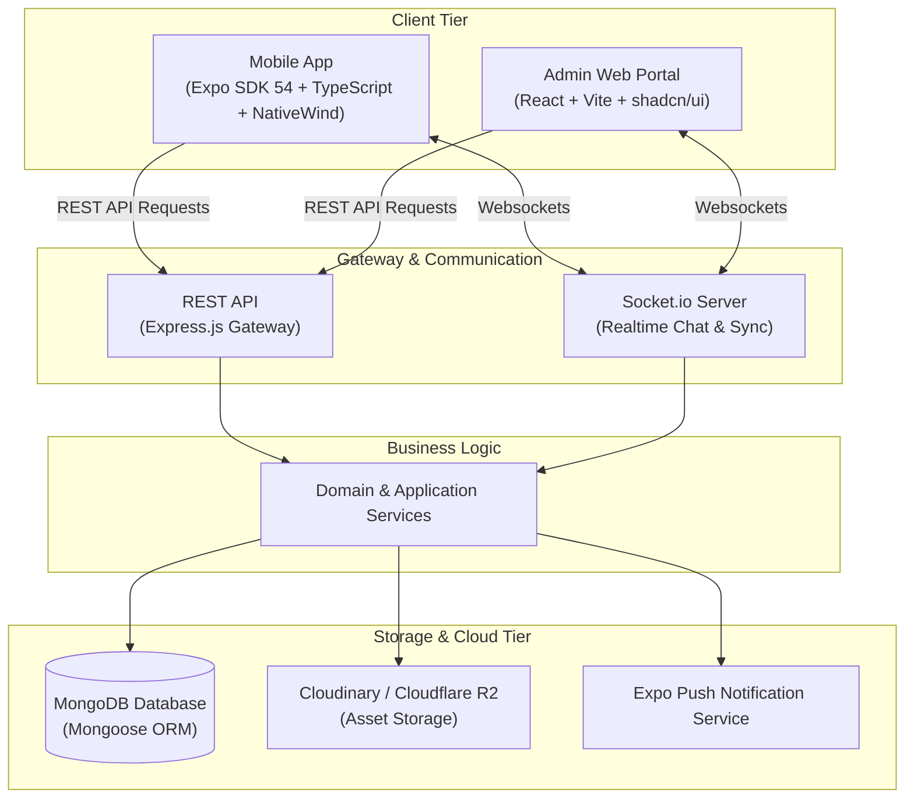
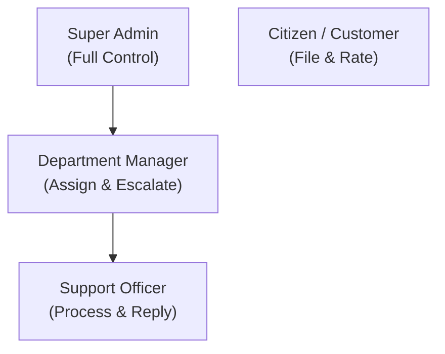
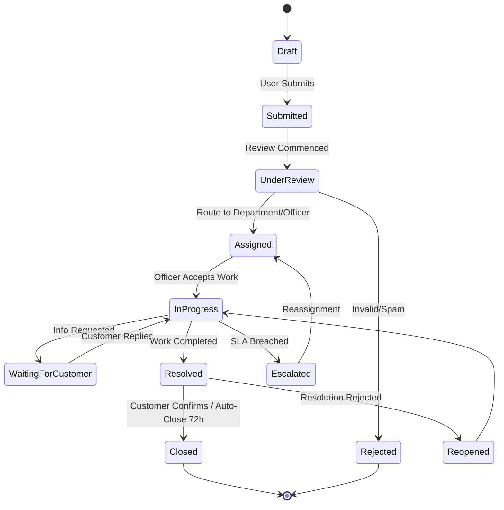

# Feature Specification: Complaint Management System (eCMS)

## 1. Project Overview

The **Complaint Management System (eCMS)** is a full-stack, enterprise-grade, and citizen-centric application designed to streamline the reporting, tracking, and resolution of public and organizational complaints. The system comprises a cross-platform mobile application for citizens, an administrative web portal for support agents and department heads, a scalable backend API, and a robust real-time communication engine.

### Key Capabilities
- **Cross-Platform Mobile App**: Expo SDK 54 mobile application with offline-first capabilities.
- **Admin Web Portal**: React and Vite dashboard with advanced analytics and team management tools.
- **Node.js Express Backend**: REST API following clean architecture principles.
- **Realtime Communications**: Socket.io for immediate chat and status synchronization.
- **Service Level Agreements (SLA)**: Automatic priority escalation and notification engines.
- **Role-Based Access Control (RBAC)**: Fine-grained permissions matching operational structures.

---

## 2. Technology Stack



### Component Details
| Component | Primary Framework / Libraries | Key Features |
| :--- | :--- | :--- |
| **Mobile App** | Expo SDK 54, React Native, Expo Router, NativeWind (Tailwind), React Hook Form, Zod, TanStack Query, Axios, Expo Image Picker, Expo Secure Store, Reanimated | Cross-platform (iOS/Android), offline data sync, smooth animations, secure credential storage, push notifications. |
| **Admin Web Portal** | React, Vite, TypeScript, TailwindCSS, shadcn/ui, TanStack Table, TanStack Query, Recharts | Dynamic dashboards, advanced filtering, role management, interactive performance/SLA reports, drag-and-drop ticket assignments. |
| **Backend API** | Node.js, Express.js, JWT, Bcrypt, Multer, Socket.io, Nodemailer, Winston Logger, Express Validator | High-performance API, token-based authentication, real-time message broadcasting, input validation, robust system audit logs. |
| **Storage & Cloud** | MongoDB, Cloudinary / Cloudflare R2, Expo Notifications | Relational-document mapping, media asset storage with compression, transactional email templates, global push delivery. |

---

## 3. System Architecture & Folder Structure

The project implements **Clean Architecture** (Separation of Concerns, Dependency Rules) combined with **SOLID** design patterns.

### Backend Structure
```
backend/
├── src/
│   ├── config/             # DB, Mail, Cloudinary, Socket connection setups
│   ├── constants/          # App constants, status enums, role definitions
│   ├── controllers/        # Express handlers (interface adapters)
│   ├── middleware/         # Auth, RBAC, error, rate-limiter, upload filters
│   ├── models/             # Mongoose schemas (data entities)
│   ├── repositories/       # Database query abstraction layer
│   ├── routes/             # API routing endpoints
│   ├── services/           # Business logic & domain services (use cases)
│   ├── utils/              # Token, hashing, mail, logger helpers
│   ├── validators/         # Request body/param validators (Express Validator)
│   └── app.ts              # Express initialization & socket handler
├── tests/                  # Unit & integration tests
├── Dockerfile              # Containerization for production deployment
└── docker-compose.yml      # Local orchestration of node & mongo services
```

### Mobile App Structure
```
mobile/
├── app/                    # Expo Router file-based pages (routes)
├── src/
│   ├── components/         # Shared UI components (inputs, list-items, buttons)
│   ├── hooks/              # Custom hooks (auth, query hooks, networking)
│   ├── services/           # Remote API requests, secure storage interface
│   ├── store/              # State management (offline state, locale)
│   ├── utils/              # Validators, date-formatting, map-helpers
│   └── validation/         # Zod schemas for forms
```

---

## 4. User Roles & Permissions

The system uses Role-Based Access Control (RBAC) to enforce boundaries between actors.



### Detailed RBAC Mapping

| User Role | Description | Core Capabilities |
| :--- | :--- | :--- |
| **Citizen / Customer** | The public facing mobile app user who initiates complaints. | - Auth via Email/OTP/Socials.<br/>- Create, edit drafts, and cancel complaints.<br/>- Attach image/video/document proof.<br/>- Live-chat with assigned Support Officers.<br/>- Receive real-time push notifications.<br/>- Rate resolutions (1-5 Stars + comments). |
| **Support Officer** | Field agents or backend processors tasked with resolving tickets. | - View queue of assigned complaints.<br/>- Update complaint state (In Progress, Resolved).<br/>- Chat with the Citizen.<br/>- Append internal-only audit notes.<br/>- Request clarification/information from Citizen. |
| **Department Manager** | Operational leads overseeing single/multiple service fields. | - Route complaints to Support Officers.<br/>- Reassign/escalate lagging or complex tickets.<br/>- View department performance charts & response times.<br/>- Access comprehensive CSV/Excel/PDF reports. |
| **Super Admin** | Platform owners with complete configuration privileges. | - Complete CRUD on Users, Roles, and Permissions.<br/>- Manage Complaint Categories and SLA periods.<br/>- Configure system notifications & escalation rules.<br/>- View system-wide Audit Logs and global metrics. |

---

## 5. Core Modules & Functional Specs

### A. Authentication & Onboarding
- **Methods**: Secure login using Email/Password, Mobile Phone + OTP, or Google SSO.
- **Secure Session Management**: JWT access tokens (short-lived, 15m) paired with HTTP-only Refresh Tokens (long-lived, 7d).
- **Mobile Storage**: Secure storage via `Expo Secure Store` for encrypting authorization tokens.
- **Roles Assignment**: Citizens default to standard permissions, administrative users are configured by the Super Admin.

### B. Complaint Workflow Engine
Complaints flow through an automated state machine. Every state shift is recorded in the `complaintHistory` collection.



### C. File Upload & Media Processor
- **Multiparts Upload**: Uses `multer` in backend and `Expo Image Picker` on client.
- **Handling**: Supports Image (JPEG, PNG), Video (MP4), and Document (PDF) formats.
- **Optimization**: Client-side downscaling and compression before upload; backend pipes payloads to Cloudinary or Cloudflare R2 bucket.
- **Resilience**: File uploads offer dynamic progress indicators, failure notifications, and a chunked-retry mechanism.

### D. Real-Time Chat System
- **Provider**: Socket.io engine synced with REST persistence.
- **Scope**: Dedicated channels mapping directly to each `complaintId`.
- **Features**:
  - Typing Indicator (e.g., "Officer is typing...")
  - Read receipts (Sent -> Delivered -> Read)
  - Online/Offline status bubbles.
  - Image and document sharing inside the chat.

### E. SLA & Escalation Engine
Admins set Service Level Agreements per priority bracket:
- **Critical**: 2 Hours
- **High**: 8 Hours
- **Medium**: 24 Hours
- **Low**: 48 Hours

#### Escalation Path
If the SLA deadline is breached without state shifting to `Resolved`:
1. System flags ticket as **Overdue** (Red banner in dashboards).
2. Sends push & email notification to **Support Officer** and **Supervisor**.
3. If unaddressed after 25% of SLA time post-breach, escalates ownership to **Department Manager**.
4. Full system log updated inside `auditLogs`.

### F. Offline Sync Logic
- **Caching**: Local database client (SQLite or AsyncStorage) buffers drafts and offline submissions.
- **Network Listener**: Listens to connection change broadcasts via NetInfo.
- **Synchronization**: Once online, a background queue pushes data to the server, updates local IDs with server-assigned MongoDB UUIDs, and alerts the user.

---

## 6. Database Schema Design (MongoDB)

Below are the schema frameworks for the core database collections.

### 1. `users`
```json
{
  "_id": "ObjectId",
  "name": "String",
  "email": "String (Unique)",
  "phone": "String (Unique)",
  "passwordHash": "String",
  "role": "ObjectId (Ref: roles)",
  "department": "ObjectId (Ref: departments)",
  "googleId": "String",
  "pushToken": "String",
  "status": "String (Enum: Active, Suspended, Inactive)",
  "createdAt": "Date",
  "updatedAt": "Date"
}
```

### 2. `complaints`
```json
{
  "_id": "ObjectId",
  "complaintNumber": "String (Unique, Formatted: COMP-YYYYMMDD-XXXX)",
  "title": "String",
  "description": "String",
  "citizen": "ObjectId (Ref: users)",
  "category": "ObjectId (Ref: complaintCategories)",
  "department": "ObjectId (Ref: departments)",
  "priority": "String (Enum: Low, Medium, High, Critical)",
  "status": "String (Enum: Draft, Submitted, UnderReview, Assigned, InProgress, WaitingForCustomer, Resolved, Closed, Rejected, Escalated, Reopened)",
  "location": {
    "type": "String (Point)",
    "coordinates": ["Number (Longitude)", "Number (Latitude)"],
    "address": "String"
  },
  "attachments": ["ObjectId (Ref: attachments)"],
  "slaDeadline": "Date",
  "isAnonymous": "Boolean",
  "escalationLevel": "Number (Default: 0)",
  "createdAt": "Date",
  "updatedAt": "Date"
}
```

### 3. `complaintHistory`
```json
{
  "_id": "ObjectId",
  "complaintId": "ObjectId (Ref: complaints)",
  "changedBy": "ObjectId (Ref: users)",
  "previousStatus": "String",
  "newStatus": "String",
  "remarks": "String",
  "createdAt": "Date"
}
```

### 4. `complaintMessages`
```json
{
  "_id": "ObjectId",
  "complaintId": "ObjectId (Ref: complaints)",
  "sender": "ObjectId (Ref: users)",
  "messageText": "String",
  "attachments": ["ObjectId (Ref: attachments)"],
  "readBy": [{
    "userId": "ObjectId (Ref: users)",
    "readAt": "Date"
  }],
  "createdAt": "Date"
}
```

### 5. `ratings`
```json
{
  "_id": "ObjectId",
  "complaintId": "ObjectId (Ref: complaints)",
  "citizen": "ObjectId (Ref: users)",
  "ratingValue": "Number (1 to 5)",
  "feedback": {
    "resolutionQuality": "Number (1 to 5)",
    "officerBehavior": "Number (1 to 5)",
    "responseSpeed": "Number (1 to 5)",
    "overallExperience": "Number (1 to 5)",
    "comments": "String"
  },
  "createdAt": "Date"
}
```

---

## 7. REST API Endpoints

All administrative and updating endpoints (excluding auth register/login) are protected by a JWT authorization middleware (`Bearer <token>`) and RBAC checker.

### Authentication Module
- `POST /api/v1/auth/register` - Create a new citizen account.
- `POST /api/v1/auth/login` - Authenticate users (returns JWT + Refresh Token).
- `POST /api/v1/auth/otp/send` - Send SMS/Email verification OTP.
- `POST /api/v1/auth/otp/verify` - Verify OTP and generate session.
- `POST /api/v1/auth/refresh` - Swap valid Refresh Token for new Access Token.
- `POST /api/v1/auth/logout` - Invalidate session tokens.

### Complaint Module
- `GET /api/v1/complaints` - Query complaints (paginated, with search and filters).
- `GET /api/v1/complaints/:id` - Fetch single complaint details, including timeline history.
- `POST /api/v1/complaints` - Submit a new complaint (accepts multipart/form-data for uploads).
- `PUT /api/v1/complaints/:id` - Update details (Citizen if Draft; Officer/Manager if processing).
- `PATCH /api/v1/complaints/:id/status` - Transition complaint state (RBAC checked).
- `POST /api/v1/complaints/:id/rate` - Citizen submits a performance rating (only valid if status is `Resolved` or `Closed`).

### Messaging & Real-Time Module
- `GET /api/v1/complaints/:id/messages` - Retrieve chat history for a specific complaint.
- `POST /api/v1/complaints/:id/messages` - Post a new message with optional media URLs.

### Admin Operations Module
- `GET /api/v1/admin/users` - View system users list.
- `PUT /api/v1/admin/users/:id/role` - Adjust user authorization levels.
- `GET /api/v1/admin/departments` - CRUD departments.
- `GET /api/v1/admin/categories` - CRUD complaint categories.
- `GET /api/v1/admin/reports/export` - Export complaint datasets (parameters: format `csv|xlsx|pdf`, filters: status, date, department).
- `GET /api/v1/admin/analytics/dashboard` - Get high-level KPI trends (SLA breach rates, average response intervals, customer satisfaction index).

---

## 8. Client Screens & UI/UX Specifications

### Mobile Application (Citizen Interface)
- **Splash Screen**: Brand representation & automatic token checking logic.
- **Login / Onboarding**: Clear tab structures for OTP vs Google Login.
- **Home Dashboard**: Total counts of active/resolved complaints, slider for fast actions, and recent alert ticker.
- **Create Complaint Form**:
  - Category selector with descriptive icons.
  - Multi-line descriptive input.
  - Interactive map integration (GPS auto-location + address search).
  - Media picker panel supporting progress overlays.
- **Complaint Timeline**: Interactive vertical steps highlighting when steps occurred (e.g. "Assigned at 10:14 AM by Agent X").
- **Realtime Chat interface**: Keyboard-avoiding text containers, image message bubbles, and typing status banner.

### Admin Web Portal (Vite + shadcn/ui)
- **Executive Analytics Board**: Recharts visualizations for Category splits, SLA compliance status, and geographic heatmap clusters.
- **Complaint Queue**: Advanced data-table using TanStack Table with inline status dropdown filters, sorting options, and selection hooks.
- **Detail Work Panel**: Side-by-side split viewport. Left: Complaint details, GPS position, attachments. Right: Interactive chat feed & internal notes editor.
- **Settings & SLA Manager**: Form builder mapping priorities to numeric durations (hours) and managing escalation notification emails.

### UI/UX Styling Guidelines
- **System Theme**: Material Design 3 guidelines for UI components, maintaining high contrast modes.
- **Modes**: Unified support for Dark and Light schemes.
- **Visual Feedback**: Skeleton placeholders during data fetching; pull-to-refresh on listing components; optimistic UI updates for chat messages.
- **Accessibility (a11y)**: Focus rings, screen-reader compatible labels, tap targets adhering to Apple (44x44pt) and Android (48x48dp) standards.

---

## 9. Security, Quality & Compliance Metrics

- **API Security**: Implementation of Helmet header configs, Express rate-limiters (e.g. max 100 queries per 15 minutes per IP), clean XSS filters, and parameterized MongoDB queries.
- **Robust Logger**: Winston logging instance outputting warning/error states in structured JSON to local files or log aggregates.
- **Strict Typing**: All configuration, request payloads, and API payloads verified with Zod schemas and TypeScript models.
- **Testing Requirements**: 
  - Unit tests targeting Core Business Services and SLA Escalation triggers.
  - Integration tests verifying CRUD endpoints and status flow validation.
- **Seed Scripts**: Database populator creating typical departments, categorized complaints, support agents, and history logs for demonstration.
- **Containerization**: Single-command startup orchestration via Docker and Docker Compose.
