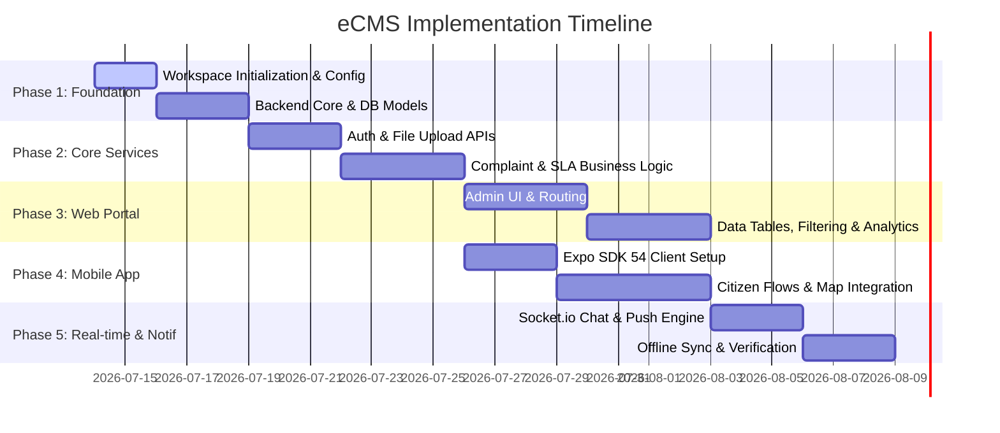

# Implementation Plan: Complaint Management System (eCMS)

This implementation plan outlines the phase-by-phase building of the complete Complaint Management System (eCMS), comprising the backend API, the React Admin Portal, and the Expo SDK 54 mobile application.

---

## Proposed Phases & Milestones

---

## Phase 1: Foundation & Backend Core Setup

### 1.1 Directory Structure & Monorepo Configuration
- Initialize the root project with a workspace/monorepo structure or individual folders:
  - `/backend` (Express.js API)
  - `/admin-portal` (Vite + React)
  - `/mobile-app` (Expo SDK 54 Router)
- Set up global `.gitignore`, ESLint, and Prettier configurations at the workspace level.

### 1.2 Express.js Boilerplate
- Initialize TypeScript inside `backend/` and configure `tsconfig.json`.
- Install dependencies: `express`, `mongoose`, `dotenv`, `cors`, `helmet`, `morgan`, `winston`, `bcryptjs`, `jsonwebtoken`.
- Set up logging utilities (`winston` + `morgan`) and global error handler middleware.
- Configure MongoDB connection helper using Mongoose.

### 1.3 Mongoose Schemas & Repositories
- Implement Mongoose schemas and models for:
  - `User`, `Role`, `Permission`, `Department`, `ComplaintCategory`.
  - `Complaint`, `ComplaintHistory`, `ComplaintMessage`, `Rating`, `AuditLog`.
- Define seeds inside `backend/src/seeds/` to auto-populate default roles, categories, and standard departments (e.g., Road Damage, Sanitation, Electricity).

---

## Phase 2: REST API Development & SLA Logic

### 2.1 Auth Module (`/auth`)
- Implement password registration with salt hashing (`bcryptjs`).
- Implement JWT generation and token-exchange logic (`POST /auth/login`, `POST /auth/refresh`, `POST /auth/logout`).
- Build RBAC authorization middleware to parse token payload scopes and match route criteria.

### 2.2 Upload Module (`/attachments`)
- Integrate `multer` for receiving multi-part file payloads.
- Configure asset upload utilities to process files and upload them securely to Cloudinary/Cloudflare R2.
- Enforce size (e.g., max 5MB for images, 20MB for videos) and MIME type validation.

### 2.3 Complaint & SLA Management (`/complaints`)
- Create API endpoints for complaint lifecycle CRUD operations.
- Build automatic priority assignment logic based on categories.
- Build an **SLA Timer background service** (using Cron or a queue processor) to scan complaints, flag overdue tickets, and execute escalation shifts (Support Officer -> Supervisor -> Manager).
- Create audit-log hooks to automatically write actions inside `auditLogs` for every status mutation.

---

## Phase 3: React Admin Web Portal

### 3.1 Portal Scaffolding & Routing
- Set up React + Vite + TypeScript inside `/admin-portal`.
- Initialize `shadcn/ui` components (buttons, dialogs, inputs, dropdowns).
- Configure `react-router-dom` (or similar router) with protected routing for Admin, Manager, and Support levels.

### 3.2 Main Dashboard & Analytics
- Build dashboard landing view displaying state summaries (Total, Open, Closed, SLA Compliance rate).
- Integrate `Recharts` for interactive category distributions, monthly resolution curves, and department performance heatmaps.

### 3.3 Ticket Queue & Detail Panel
- Build high-density queue lists utilizing `TanStack Table` (featuring client & server-side pagination, status filters, priority colors, and search boxes).
- Create a Detail Panel presenting the complete complaint history timeline, GPS map markers, evidence attachments (image lightbox, video playback, PDF view), and an integrated chat side-drawer.

---

## Phase 4: Expo Mobile Application

### 4.1 Client Scaffolding & Theme
- Initialize Expo SDK 54 template utilizing TypeScript and Expo Router.
- Set up styling using `NativeWind` (TailwindCSS framework for React Native).
- Implement light/dark themes and configure typography using dynamic fonts (Inter/Outfit).

### 4.2 Auth & Secure Token Storage
- Build Splash screen check routing users depending on token presence in `Expo Secure Store`.
- Build Register, Email/OTP Login, and Social Google Sign-in screens.

### 4.3 Citizen Submission Flow
- Build Dashboard summarizing customer's history.
- Create multi-step creation form:
  - Title, description, and category selectors.
  - Location mapping picker combining GPS coordinate lookup and reverse-geocoding addresses.
  - Image/Video camera pickers with upload progress bars.
- Build Timeline tracking page illustrating processing milestones visually.

---

## Phase 5: Real-time Sync & Final Integration

### 5.1 Real-time Engine (Socket.io)
- Setup Socket.io on backend app and integrate clients (Admin portal & Expo mobile app).
- Implement typing statuses, read state updates, and online presence indicators.
- Synchronize status updates instantly so admins and citizens see mutations without refresh.

### 5.2 Push Notification Services
- Integrate `Expo Notifications` SDK.
- Configure backend trigger routines to dispatch push payloads to devices on status change or direct messages.

### 5.3 Offline Support Engine
- Configure AsyncStorage or SQLite caching layer inside the mobile app to persist active drafts and pending ticket syncs.
- Implement network connectivity listener to automatically retry pending requests when returning online.

---

## Verification Plan

### Automated Verification
- **Unit Tests**:
  - Run `npm run test:unit` inside `/backend` to verify state machine transitions, SLA escalation triggers, and RBAC middleware.
- **Integration Tests**:
  - Run `npm run test:integration` inside `/backend` validating API endpoint routing, validation responses, and file type validation filters.

### Manual Verification
1. **Developer Dry-Run**: Run standard docker container orchestrating backend and verify MongoDB collection seeding.
2. **Citizen Flow**: Log in as a customer on simulated mobile device, create complaint with attachments, check offline creation behavior under offline simulation.
3. **Admin Flow**: Open Admin portal on browser, locate newly created ticket, assign it, trigger chat exchanges, and monitor real-time message arrivals and read receipts.
4. **SLA Breach**: Artificially modify database ticket timestamps to force SLA breaches and confirm supervisor notifications and escalations run.
